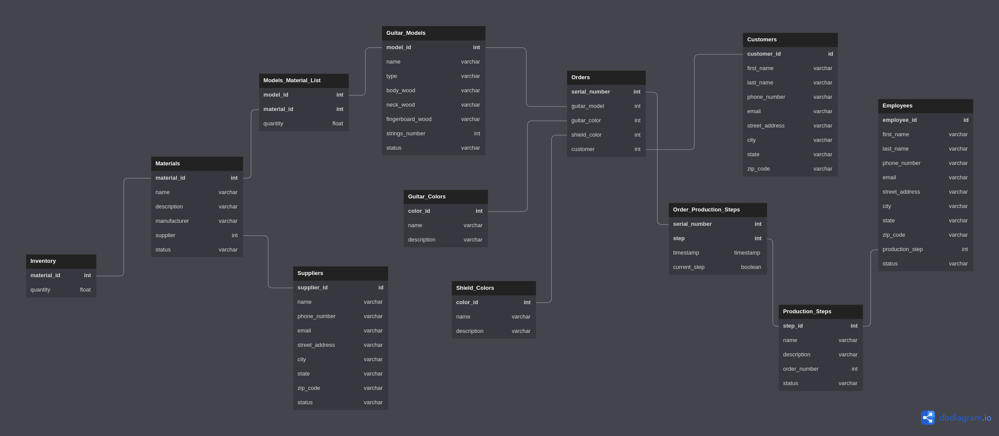

# Guitar Factory Database Design Project
Portfolio Project containing a Database Project designed for a Guitar Factory, following the guidelines of the book "Database Design for Mere Mortals", by Michael J. Hernandez.

Below, the main parts of the Projects are briefly described.

## Mission Statement and Objectives

Here you will find a brief statement defining the purpose of the database and some operational objectives desired to be achieved with it. It can be found on the Mission.md file.

## Final Table List

Here, you will find a listing of all the tables on the database, together with their table type and a brief description containing what the table stores and why it exists. It can be found on the Final_Table_List.md file. 

## Table Structures

Here, you will find another listing of the Tables of the Database, but this time together with all of their fields. It can be found on the Table_STructures.md file.

## Entity Relationship Diagram

Here, you will find the Entity-Relationship Diagram of the designed database, containing all the tables, their fields and the relationship between them. It can be found below or on the Entity_Relationship_Diagram.md file for better visibility

 

## Field Specifications

Here, you will find an extensive documentation for all the Fields of the Designed Database, involving General, Physical and Logical Charactesristics of each field. It can be found under the Field_Specifications directory. 

## Business Rules

Here, you will find documentations for some Business Rules that could already be defined on the Database Design process, involving both rules to be implemented by the Database itself and rules to be implemented by the Application consuming the database. It can be found under the Business Rules directory.
